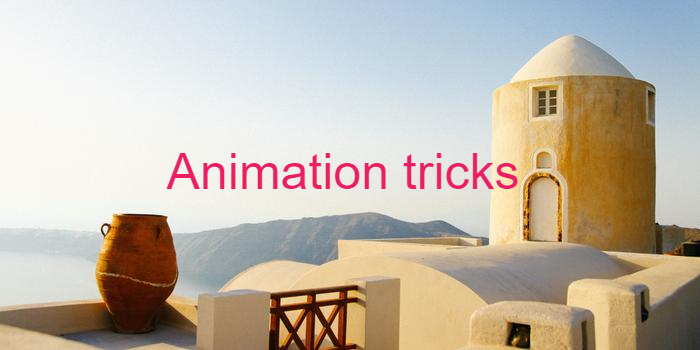

# Some of my animation tricks

In this block of files I was trying to improve my skills in operating with **Animation** effects within *CSS*

---

My [repo](https://github.com/FaninIS/Animation-practice.git) contains a number of stand alone cases i.e:

1. **curousAnimation** 
> An object changes its shape, scale and postion as per rotation axle

2. **pulsingCircles**
> Eight equial size but different in colours circles are pulsing synchronously

3. **rotatingPlanet**
> I did it however need more practice. A planet is rotating along its orbit around the [Earth](https://en.wikipedia.org/wiki/Google_Earth)

By this drills I managed to learn how the property `transition` and `transform` works 